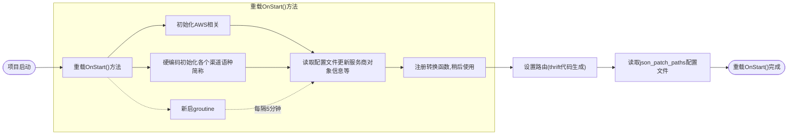
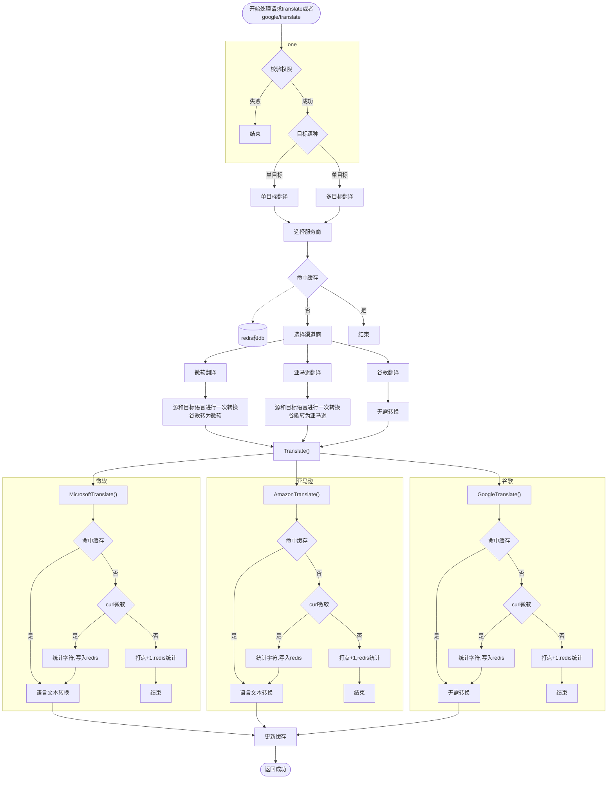

为了解决各个项目对不同翻译渠道的需求，平台开发了统一的翻译服务。

目前支持将Google、MicroSoft、Amazon作为翻译服务提供源。并且内置翻译缓存，以减少对翻译服务的重复请求导致的成本浪费。

## 接入须知

翻译服务是开箱即用的，您不需要做任何的接入准备即可使用。

默认情况下，您的翻译请求有40%几率会使用Microsoft渠道进行翻译、0.1%几率使用Amazon、59.9%使用Google翻译。

对于部分Amazon翻译返回的错误结果（小概率、取决于翻译服务商当下服务稳定性以及输入是否合法等因素），我们会使用MicroSoft渠道进行重新翻译。

另外，我们在翻译服务中增加了服务切换功能，对于各服务商当前的服务质量进行跟踪。当某服务商当下处于服务异常时，会优先使用其他服务商的翻译服务，确保平台服务稳定可用。

## 服务地址

翻译服务的地址请通过`Name`服务获取，服务名为`translate`。

## API文档
请查阅[Translate服务的API文档](https://wiki.tap4fun.com/display/TGS/Translate-API)

## 免翻译文本处理

针对Emoji表情、特殊内容等需要禁止的翻译内容，请使用`translate`属性值为`no`的HTML标签进行包裹。参见 [HTML标准文档](https://developer.mozilla.org/zh-CN/docs/Web/HTML/Global_attributes/translate)

例如`我爱北京天安门`中的`北京`就可以不会被翻译。

详见 [Google](https://cloud.google.com/translate/troubleshooting) 的文档以及 [Microsoft](https://docs.microsoft.com/en-us/azure/cognitive-services/translator/prevent-translation) 的文档

## 翻译内容对照

由于我们的翻译服务商有多家，如果您对翻译结果有疑问，可以对照这几家的官方翻译检查结果：

- [Google](https://www.google.com/translate)
- [Microsoft](https://www.bing.com/translator)
- [AWS](https://console.aws.amazon.com/translate/home) （需要登陆）

## 流程图

### 项目启动流程图

### translate接口流程图

